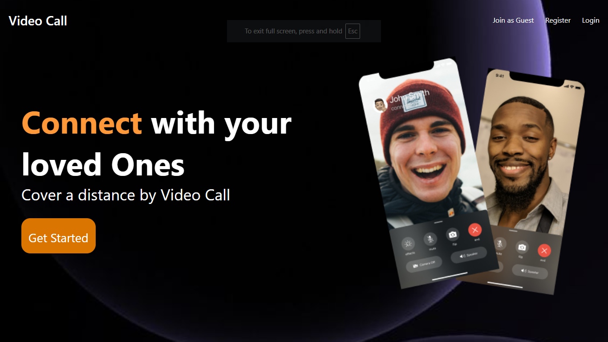
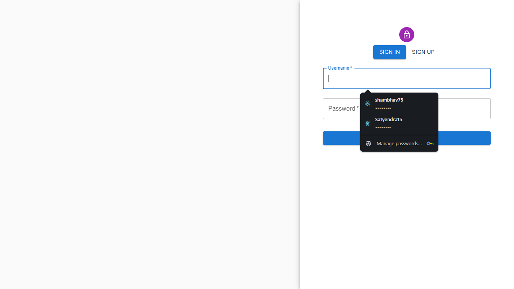
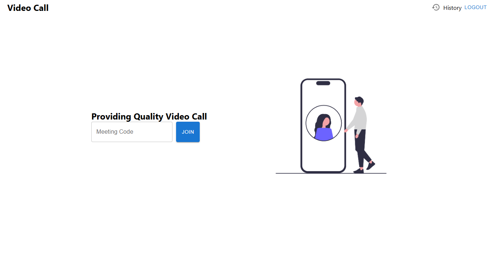
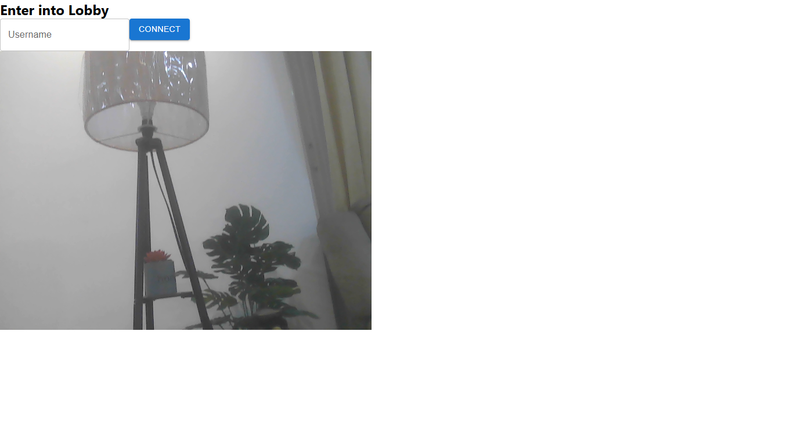
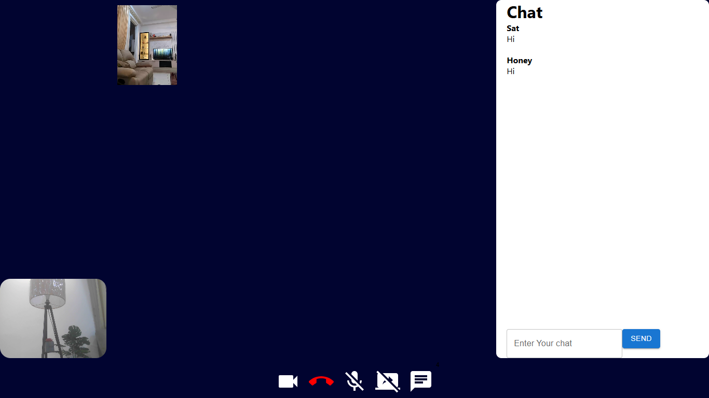
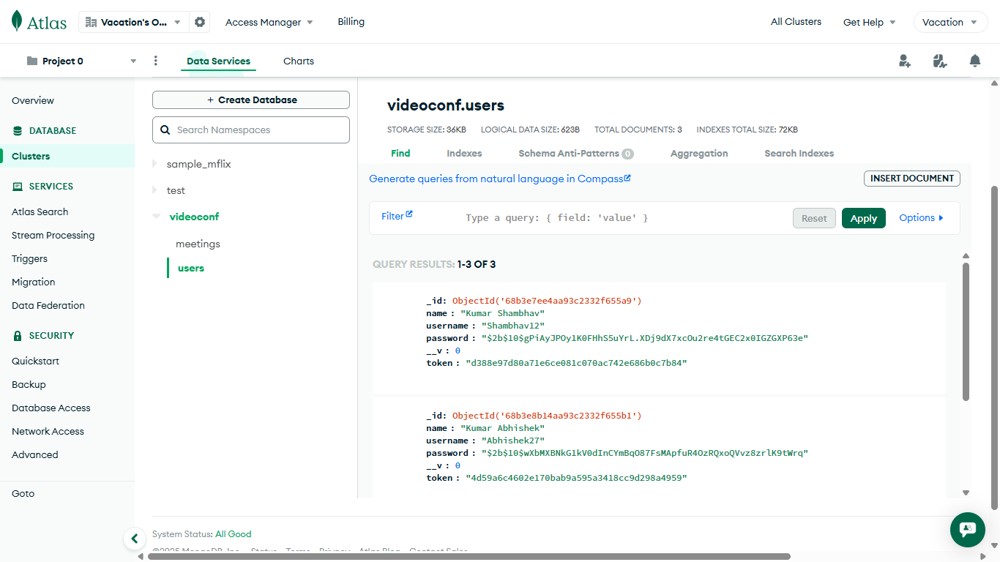

# 📹 Video Conferencing Web App

A full-stack video conferencing application built with **MERN stack** and **WebRTC + Socket.IO**, allowing users to connect via video calls, chat, and meetings in real-time.  

🌐 **Live Demo:** [Video Conferencing App](https://video-conferencing-web-app-1.onrender.com)

---

## 🚀 Features
- 🔐 User Authentication (Register, Login, Guest Access)
- 📹 High-quality Video & Audio Calls (WebRTC + Socket.IO)
- 💬 Real-time Chat during video call
- 🎥 Join via Meeting Code
- 👤 User management with MongoDB
- 📜 Meeting History tracking
- 🌍 Hosted on **Render** with MongoDB Atlas

---

## 🛠️ Tech Stack
- **Frontend:** React.js, Socket.IO Client  
- **Backend:** Node.js, Express.js, Socket.IO  
- **Database:** MongoDB Atlas  
- **Authentication:** JWT + bcrypt  
- **Deployment:** Render  

---

## 📸 Screenshots  

### 🏠 Home Page  


### 🔐 Login / Register  


### 🎥 Join Meeting  


### 🚪 Lobby  


### 📞 Video Call + Chat  


### 📊 MongoDB User Data  


---

## ⚡ Getting Started

### 1️⃣ Clone the repository
```bash
git clone https://github.com/Shambhav-07/Video-Conferencing-Web-App.git
cd Video-Conferencing-Web-App
```

### 2️⃣ Backend Setup
```bash
cd backend
npm install
npm run dev
```

### 3️⃣ Frontend Setup
```bash
cd frontend
npm install
npm start
```

### 4️⃣ Environment Variables
```bash
PORT=8000
MONGO_URI=your-mongodb-uri
JWT_SECRET=your-secret
```

---

### 👨‍💻 Author
-Kumar Shambhav
---

### 📬 Contact Me For Help:

💼 LinkedIn: www.linkedin.com/in/krshambhav

📧 Email: Kumarshambhav75@gmail.com